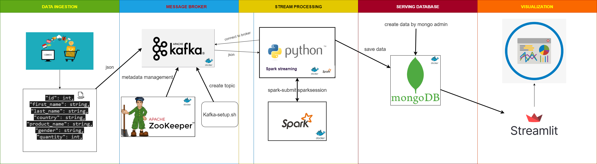

# Real Time Data Pipeline 

## TABLE OF CONTENT
1. [INTRODUCTION](#1-Introduction)
2. [PROJECT STRUCTURE](#2-PROJECT-STRUCTURE)
3. [Run](#3-Run)


### INTRODUCTION
This project built a real time data pipeline for ecommerce data, all the data were stream by kafka combine pyspark and store in mongodb.
Finally create a dashboard to visualize data by streamlit.
The project will allow for real time analytics on the ecommerce website, allowing for more efficient decision making and better customer experience. The data pipeline will make it easier to understand user behavior and trends, which will be beneficial for the website.

#### Tool used
+ Docker
+ Streamlit
+ Kafka
+ Spark
+ Mongodb

### PROJECT-STRUCTURE

- **Dashboard:** 
  - **dashboard.py**
- **Data-Generator:** Generate data from dataset.csv
  - **AddUser.py**
  - **dataset.csv**
  - **Producer.py**
- **database:** Created when mongodb server generate
- **ETD_E_VENV** virtual environment
- **kafka**
  - **kafka-setup.sh** create kafka topic

- **Stream:** 
    - **Aggregate_Country.py** 
    - **Aggregate_Gender.py** 
    - **Aggregate_Product.py**
    - **Aggregate_Product.py**
    - **jars** jar file use to submit spark application

- docker-compose.yaml.py
- LICENSE
- .gitignore
- activate.sh
- readme.md
- requirements.txt

### Run
To run application 
Firstly install dependancies.
- Install dependencies:
```bash
pip install -r requirements.txt
```
secondly, create kafka-topic
```bash
cd kafka
bash kafka-setup.sh
```
lastly, Run project:
```bash
#run application
bash activate.sh
```
